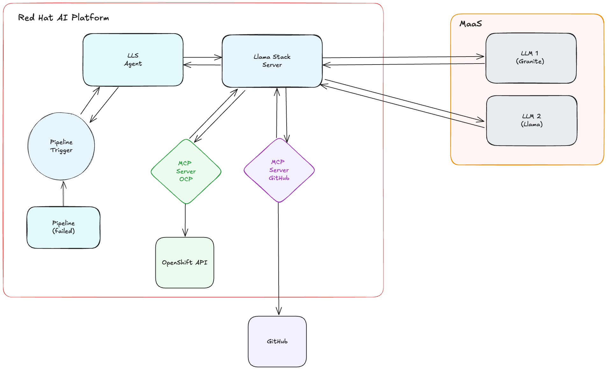
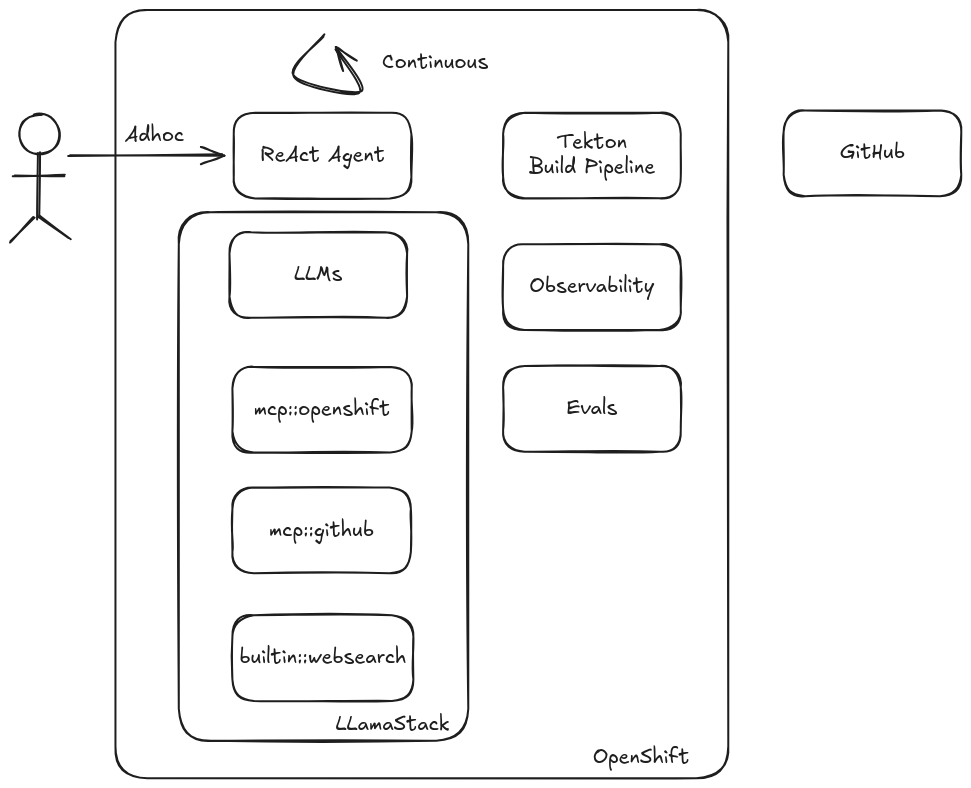

= ETX Agentic AI Hackathon Repository

== Overview

This repository contains the complete implementation and resources for the Agentic AI portion of the ETX-2 Hackathon. It demonstrates a comprehensive agentic AI use case that includes:

* **Intelligent AI Agents**: Python-based agent LLaMA Stack (LLS) for autonomous task execution (and an optional example agent that leverages DSPy for context engineering)
* **Tool and Model Context Protocol (MCP) Integration**: Built-in LLS Stack tools for internet search, and standaloneMCP servers for GitHub, OpenShift, and connection to other external services
* **Infrastructure as Code**: Complete Kubernetes/OpenShift deployment configurations using full GitOps principles
* **Observability Stack**: Monitoring, tracing, and logging capabilities for AI agent performance
* **Educational Content**: Comprehensive documentation and lab guides built with Antora for consumption by the ETX AI  participants

The project showcases modern AI agent architectures with enterprise-grade deployment patterns, featuring distributed model serving, secure secret management, and scalable container orchestration. It serves as both a working implementation and a learning resource for building production-ready agentic AI systems. This can be used as a template for building and delivering your own agentic AI use cases.

=== Getting Started

The following diagrams provide an overview of the agentic application architecture and system design.

.Agentic Application Architecture Overview
[link=./notes/agentic-app-diagram.png]

.Agentic Application System Design
[link=./notes/system-design.png]

== Contributing

Please see the link:CONTRIBUTING.adoc[Contributing Guide] for information on how to contribute to this project.

